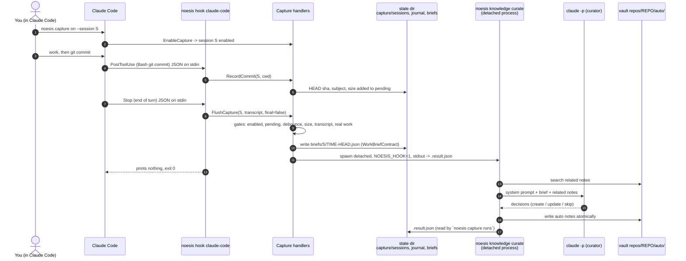

# The whole pipeline: from a commit to a note

The other pages are pieces of this single flow. Claude Code runs the hooks; nobody types
them.

```mermaid
sequenceDiagram
    autonumber
    actor Dev as You (in Claude Code)
    participant CC as Claude Code
    participant Hook as noesis hook claude-code
    participant Cap as Capture handlers
    participant State as state dir<br/>capture/sessions, journal, briefs
    participant Cur as noesis knowledge curate<br/>(detached process)
    participant LLM as claude -p (curator)
    participant Vault as vault repos/REPO/auto/

    Dev->>CC: noesis capture on --session S
    CC->>Cap: EnableCapture -> session S enabled
    Dev->>CC: work, then git commit
    CC->>Hook: PostToolUse (Bash git commit) JSON on stdin
    Hook->>Cap: RecordCommit(S, cwd)
    Cap->>State: HEAD sha, subject, size added to pending
    CC->>Hook: Stop (end of turn) JSON on stdin
    Hook->>Cap: FlushCapture(S, transcript, final=false)
    Cap->>Cap: gates: enabled, pending, debounce, size, transcript, real work
    Cap->>State: write briefs/S/TIME-HEAD.json (WorkBriefContract)
    Cap->>Cur: spawn detached, NOESIS_HOOK=1, stdout -> .result.json
    Hook-->>CC: prints nothing, exit 0
    Cur->>Vault: search related notes
    Cur->>LLM: system prompt + brief + related notes
    LLM-->>Cur: decisions (create / update / skip)
    Cur->>Vault: write auto notes atomically
    Cur->>State: .result.json (read by `noesis capture runs`)
```

Back to [workflows](README.md).
