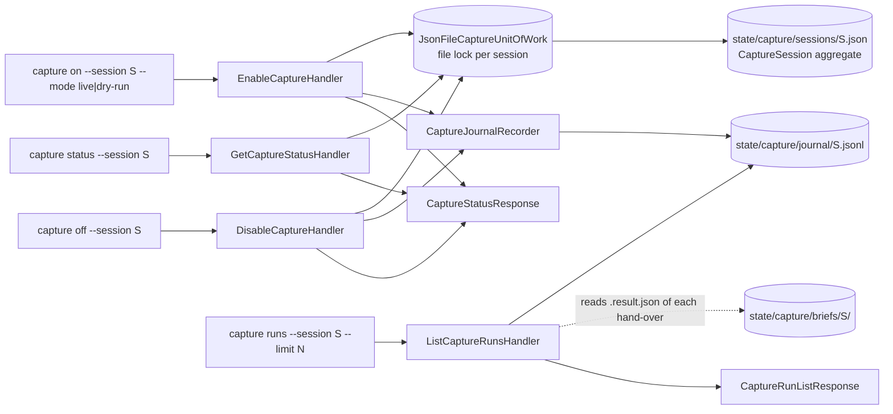

# `capture on | off | status | runs`

```mermaid
flowchart LR
    con["capture on --session S --mode live|dry-run"] --> en[EnableCaptureHandler]
    coff["capture off --session S"] --> dis[DisableCaptureHandler]
    st["capture status --session S"] --> gs[GetCaptureStatusHandler]
    runs["capture runs --session S --limit N"] --> lr[ListCaptureRunsHandler]

    en --> uow[("JsonFileCaptureUnitOfWork<br/>file lock per session")]
    dis --> uow
    gs --> uow
    uow --> sess[("state/capture/sessions/S.json<br/>CaptureSession aggregate")]
    en --> rec[CaptureJournalRecorder]
    dis --> rec
    rec --> jr[("state/capture/journal/S.jsonl")]
    lr --> jr
    lr -.->|"reads .result.json of each hand-over"| briefs[("state/capture/briefs/S/")]

    gs --> resp1[CaptureStatusResponse]
    en --> resp1
    dis --> resp1
    lr --> resp2[CaptureRunListResponse]
```

`off` keeps pending commits; `on` again resumes with them.

Back to [workflows](README.md).
