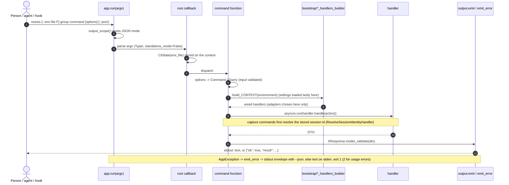

# Every command: the common path

```mermaid
sequenceDiagram
    autonumber
    actor Caller as Person / agent / hook
    participant Run as app.run(argv)
    participant Root as root callback
    participant Cmd as command function
    participant Boot as bootstrap/*_handlers_builder
    participant H as handler
    participant Out as output.emit / emit_error

    Caller->>Run: noesis [--env-file F] group command [options] [--json]
    Run->>Run: output_scope() resets JSON mode
    Run->>Root: parse argv (Typer, standalone_mode=False)
    Root->>Root: CliState(env_file) stored on the context
    Root->>Cmd: dispatch
    Cmd->>Cmd: options -> Command / Query (input validated)
    Cmd->>Boot: build_CONTEXT(environment) (settings loaded lazily here)
    Boot-->>Cmd: wired handlers (adapters chosen here only)
    Cmd->>H: asyncio.run(handler.handle(action))
    Note over Cmd,H: capture commands first resolve the stored session id (ResolveSessionIdentityHandler)
    H-->>Cmd: DTO
    Cmd->>Out: XResponse.model_validate(dto)
    Out-->>Caller: stdout: text, or {"ok": true, "result": ...}
    Note over Run,Out: AppException -> emit_error -> stdout envelope with --json, else text on stderr, exit 1 (2 for usage errors)
```

`--version` and `--help` stop at the root callback: no settings are read.

Back to [workflows](README.md).
