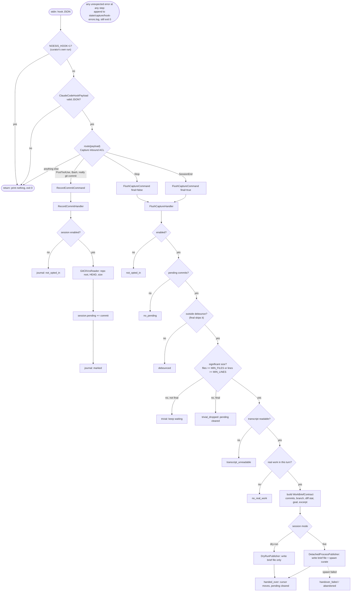

# `hook claude-code` (run by Claude Code, never by hand)

```mermaid
flowchart TD
    start(["stdin: hook JSON"]) --> guard{"NOESIS_HOOK=1?<br/>(curator's own run)"}
    guard -->|yes| quiet(["return: print nothing, exit 0"])
    guard -->|no| parse{"ClaudeCodeHookPayload<br/>valid JSON?"}
    parse -->|no| quiet
    parse -->|yes| route{"route(payload)<br/>Capture inbound ACL"}
    route -->|"PostToolUse, Bash, really git commit"| rc[RecordCommitCommand]
    route -->|Stop| fl["FlushCaptureCommand final=false"]
    route -->|SessionEnd| ff["FlushCaptureCommand final=true"]
    route -->|anything else| quiet
    rc --> rch[RecordCommitHandler]
    rch --> g0{session enabled?}
    g0 -->|no| j1["journal: not_opted_in"]
    g0 -->|yes| git["GitCliVcsReader: repo root, HEAD, size"] --> pend["session.pending += commit"] --> j2["journal: marked"]

    fl --> fh[FlushCaptureHandler]
    ff --> fh
    fh --> s1{enabled?} -->|no| k1[not_opted_in]
    s1 -->|yes| s2{pending commits?} -->|no| k2[no_pending]
    s2 -->|yes| s3{"outside debounce?<br/>(final skips it)"} -->|no| k3[debounced]
    s3 -->|yes| s4{"significant size?<br/>files >= MIN_FILES or lines >= MIN_LINES"}
    s4 -->|"no, not final"| k4["trivial: keep waiting"]
    s4 -->|"no, final"| k5["trivial_dropped: pending cleared"]
    s4 -->|yes| s5{transcript readable?} -->|no| k6[transcript_unreadable]
    s5 -->|yes| s6{real work in this turn?} -->|no| k7[no_real_work]
    s6 -->|yes| mkbrief["build WorkBriefContract<br/>commits, branch, diff stat, goal, excerpt"]
    mkbrief --> mode{session mode}
    mode -->|dry-run| dry["DryRunPublisher: write brief file only"]
    mode -->|live| live["DetachedProcessPublisher: write brief file + spawn curate"]
    dry --> ok["handed_over: cursor moves, pending cleared"]
    live --> ok
    live -.->|spawn failed| fail["handover_failed / abandoned"]

    errors(["any unexpected error at any step:<br/>append to state/capture/hook-errors.log, still exit 0"])
```

Every outcome (`k1`..`k7`, `ok`, `fail`) is a journal line, which is what `capture runs` shows.

Back to [workflows](README.md).
