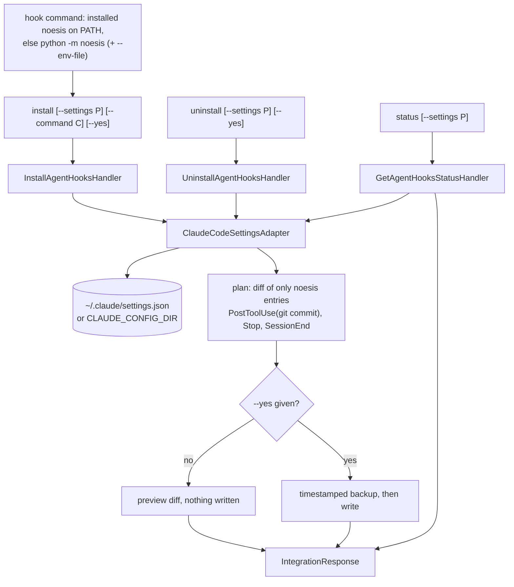

# `integrate claude-code install | uninstall | status`

```mermaid
flowchart TD
    inst["install [--settings P] [--command C] [--yes]"] --> ih[InstallAgentHooksHandler]
    uninst["uninstall [--settings P] [--yes]"] --> uh[UninstallAgentHooksHandler]
    stat["status [--settings P]"] --> sh[GetAgentHooksStatusHandler]
    cmdres["hook command: installed noesis on PATH,<br/>else python -m noesis (+ --env-file)"] --> inst

    ih --> reg[ClaudeCodeSettingsAdapter]
    uh --> reg
    sh --> reg
    reg --> file[("~/.claude/settings.json<br/>or CLAUDE_CONFIG_DIR")]
    reg --> plan["plan: diff of only noesis entries<br/>PostToolUse(git commit), Stop, SessionEnd"]
    plan --> yes{"--yes given?"}
    yes -->|no| preview["preview diff, nothing written"]
    yes -->|yes| write["timestamped backup, then write"]
    preview --> resp[IntegrationResponse]
    write --> resp
    sh --> resp
```

Back to [workflows](README.md).
