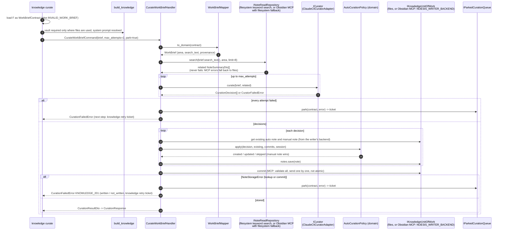

# `knowledge curate --brief-file F`

```mermaid
sequenceDiagram
    autonumber
    participant Cmd as knowledge curate
    participant Boot as build_knowledge
    participant H as CurateWorkBriefHandler
    participant Map as WorkBriefMapper
    participant Read as INoteReadRepository<br/>(filesystem keyword search, or Obsidian MCP<br/>with filesystem fallback)
    participant Cur as ICurator<br/>(ClaudeCliCuratorAdapter)
    participant Pol as AutoCurationPolicy (domain)
    participant UoW as IKnowledgeUnitOfWork<br/>(files, or Obsidian MCP: NOESIS_WRITER_BACKEND)
    participant Q as IParkedCurationQueue

    Cmd->>Cmd: load F as WorkBriefContract (else INVALID_WORK_BRIEF)
    Cmd->>Boot: vault required only where files are used, system prompt resolved
    Cmd->>H: CurateWorkBriefCommand(brief, max_attempts=2, park=true)
    H->>Map: to_domain(contract)
    Map-->>H: WorkBrief (area, search_text, provenance)
    H->>Read: search(brief.search_text(), area, limit=8)
    Read-->>H: related NoteSummaryDto[]<br/>(never fails: MCP errors fall back to files)
    loop up to max_attempts
        H->>Cur: curate(brief, related)
        Cur-->>H: CurationDecision[] or CuratorFailedError
    end
    alt every attempt failed
        H->>Q: park(contract, error) -> ticket
        H-->>Cmd: CurationFailedError (next step: knowledge retry ticket)
    else decisions
        loop each decision
            H->>UoW: get existing auto note and manual note (from the writer's backend)
            H->>Pol: apply(decision, existing, commits, session)
            Pol-->>H: created / updated / skipped (manual note wins)
            H->>UoW: notes.save(note)
        end
        H->>UoW: commit (MCP: validate all, send one by one, not atomic)
        alt NoteStorageError (lookup or commit)
            H->>Q: park(contract, error) -> ticket
            H-->>Cmd: CurationFailedError KNOWLEDGE_201 (written / not_written, knowledge retry ticket)
        else stored
            H-->>Cmd: CurationResultDto -> CurationResponse
        end
    end
```

Back to [workflows](README.md).
