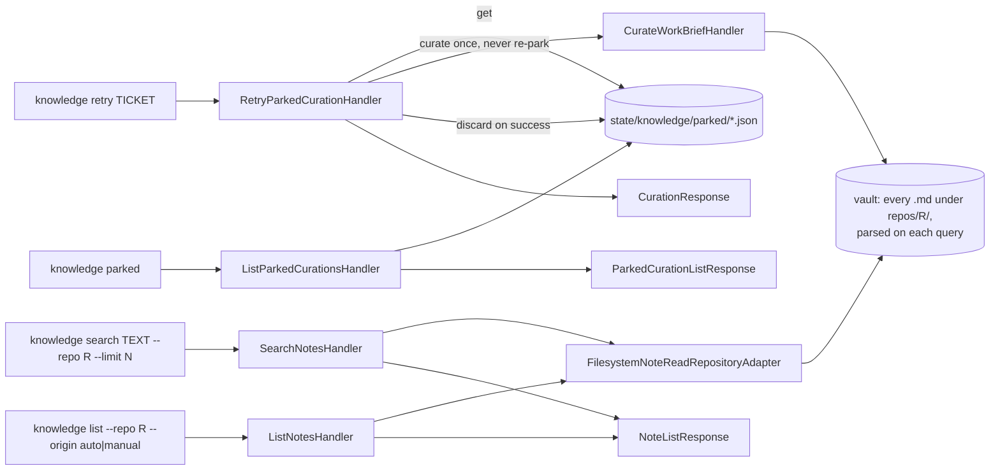

# `knowledge retry | parked | search | list`

```mermaid
flowchart LR
    retry["knowledge retry TICKET"] --> rh[RetryParkedCurationHandler]
    rh -->|get| q[("state/knowledge/parked/*.json")]
    rh -->|"curate once, never re-park"| ch[CurateWorkBriefHandler]
    rh -->|"discard on success"| q

    parked["knowledge parked"] --> ph[ListParkedCurationsHandler] --> q

    search["knowledge search TEXT --repo R --limit N"] --> sh[SearchNotesHandler]
    list["knowledge list --repo R --origin auto|manual"] --> lh[ListNotesHandler]
    sh --> rr[FilesystemNoteReadRepositoryAdapter]
    lh --> rr
    rr --> vault[("vault: every .md under repos/R/,<br/>parsed on each query")]

    ch --> vault
    rh --> r1[CurationResponse]
    ph --> r2[ParkedCurationListResponse]
    sh --> r3[NoteListResponse]
    lh --> r3
```

Back to [workflows](README.md).
